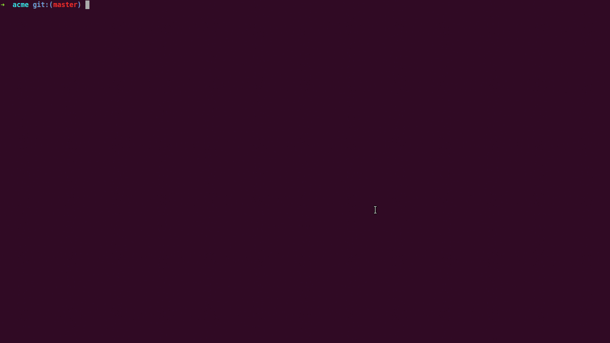

# composer-changelogs

[](https://packagist.org/packages/pyrech/composer-changelogs)
[](https://packagist.org/packages/pyrech/composer-changelogs)
[](https://packagist.org/packages/pyrech/composer-changelogs)
[](https://travis-ci.org/pyrech/composer-changelogs)
[](https://scrutinizer-ci.com/g/pyrech/composer-changelogs/?branch=master)
[](https://scrutinizer-ci.com/g/pyrech/composer-changelogs/?branch=master)

composer-changelogs is a plugin for Composer. It displays some texts after each
Composer update to nicely summarize the modified packages with links to release
and compare urls. Just copy it in your commit body and you get a nice
description.



## Installation

You can install it either globally:

```shell
composer global require "pyrech/composer-changelogs"
```

or locally:

```shell
composer require --dev "pyrech/composer-changelogs"
```

## Usage

That's it! Composer will enable automatically the plugin as soon it's
installed. Just run your Composer updates as usual :)

If you no longer want to display summary, you can either:
- run your Composer command with the option `--no-plugins`
- uninstall the package

## Further documentation

You can see the current and past versions using one of the following:

* the `git tag` command
* the [releases page on Github](https://github.com/pyrech/composer-changelogs/releases)
* the file listing the [changes between versions](CHANGELOG.md)

And finally some meta documentation:

* [versioning and branching models](VERSIONING.md)
* [contribution instructions](CONTRIBUTING.md)

## Credits

* [Loïck Piera](https://github.com/pyrech)
* [All contributors](https://github.com/pyrech/composer-changelogs/graphs/contributors)

Kudos to [Damien Alexandre](https://github.com/damienalexandre) for the idea.

## License

composer-changelogs is licensed under the MIT License - see the [LICENSE](LICENSE)
file for details.
